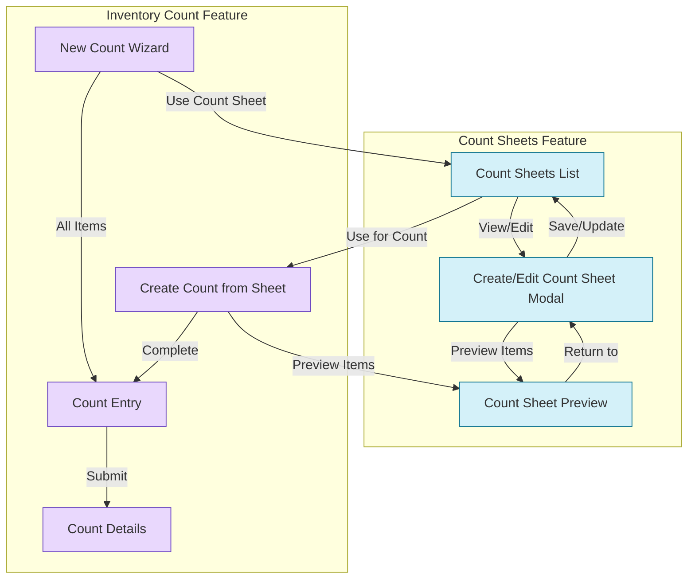

# Count Sheets Implementation

## Overview

Count Sheets is a new feature that integrates seamlessly with the existing Inventory Count system. It provides a way to save and reuse frequently used inventory count scopes, streamlining the counting process for recurring counts.

## Integration with Inventory Counts

The integration between Count Sheets and Inventory Counts follows this workflow:

## Changes Made

### 1. New Count Wizard

The New Count Wizard has been simplified to remove the redundant "Filtered Items" scope option, as this functionality is now provided by the dedicated Count Sheets feature. The wizard now offers two clear options:

- **All Items**: Count all active inventory items at selected branch
- **Use Count Sheet**: Directs users to the Count Sheets feature for more specialized scope selection

This change prevents duplication of functionality and provides users with a clearer path to using saved count templates.

### 2. Count Sheets Interface

The Count Sheets feature provides a dedicated interface for:
- Creating and managing saved count templates
- Defining complex criteria (categories, suppliers, storage areas, tags)
- Starting counts from saved templates
- Previewing item selection before counting

### 3. Navigation Integration

We've added dedicated navigation links between both features:
- From Counts page to Count Sheets
- From New Count Wizard to Count Sheets 
- From Count Sheets to create new counts

### 4. Business Logic

We've ensured consistent business logic between:
- Count creation from wizard (for all items)
- Count creation from count sheets (for filtered items)

Both follow the same workflow for:
- Snapshot creation
- Count session management
- Stock variance calculation

### 5. Permissions & Security

Both features enforce the same RBAC (Role-Based Access Control) permissions:
- Create/Edit Count Sheets: BUSINESS_OWNER
- Use Count Sheets: Appropriate staff roles
- Create/Edit Counts: Same permission model

## Technical Notes

1. **Count Sheet Usage Tracking**: When a count sheet is used to create a count, we update its `lastUsedAt` timestamp.

2. **Item Resolution**: When starting a count from a sheet, items are resolved server-side at count creation time, not dynamically during counting.

3. **Criteria Handling**: Count sheets support complex criteria (multiple categories, suppliers, storage areas), which are more powerful than the previous inline filtering.

4. **Performance**: Server-side filtering and pagination ensure good performance even with large item catalogs.

## User Experience

The new workflow provides several UX improvements:

1. **Cleaner Wizard**: Simplified count wizard with fewer steps
2. **Specialized Interfaces**: Dedicated interfaces for each task
3. **Better Reusability**: Save and reuse count configurations
4. **Enhanced Preview**: Preview items before starting counts
5. **Clear Navigation**: Intuitive navigation between related features

## Conclusion

By removing the redundant "Filtered Items" scope from the Count Wizard and integrating the dedicated Count Sheets feature, we've created a more logical, maintainable, and user-friendly inventory counting solution while avoiding duplication of functionality.
