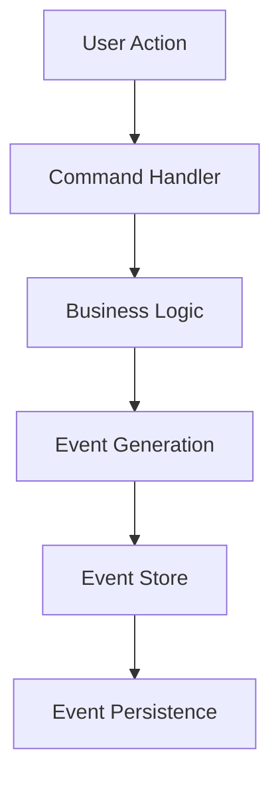
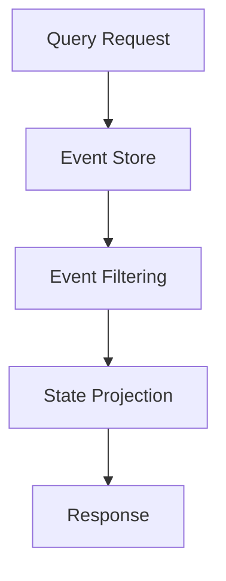
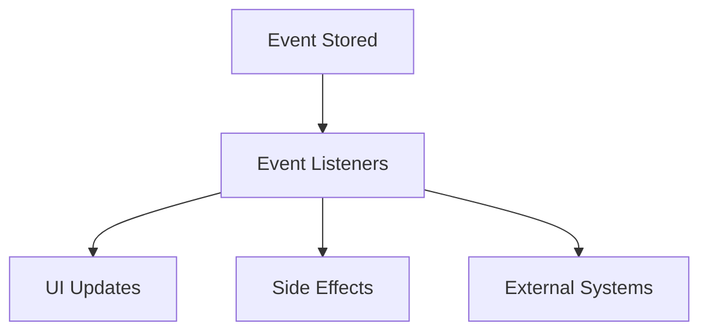

# Architecture Guide

## Overview

RMS v3 is built on a modern, event-driven architecture that prioritizes data consistency, auditability, and offline-first capabilities. This document provides a comprehensive overview of the system's architectural decisions and patterns.

## Core Architectural Principles

### 1. Event Sourcing

All state changes in the system are captured as immutable events. Instead of storing current state, we store the sequence of events that led to that state.

**Benefits:**
- Complete audit trail of all changes
- Ability to replay events to reconstruct state
- Natural support for temporal queries
- Simplified debugging and troubleshooting

**Implementation:**
```typescript
// Events are immutable records of what happened
const saleEvent = {
  id: 'evt_123',
  type: 'sale.recorded',
  at: Date.now(),
  aggregate: { id: 'T-123', type: 'ticket' },
  payload: {
    ticketId: 'T-123',
    lines: [{ sku: 'burger', name: 'Classic Burger', qty: 1, price: 12.99, taxRate: 0.15 }],
    totals: { subtotal: 12.99, discount: 0, tax: 1.95, total: 14.94 }
  }
};
```

### 2. CQRS (Command Query Responsibility Segregation)

We separate read and write operations to optimize for different access patterns:

- **Commands**: Write operations that generate events
- **Queries**: Read operations that project from events

**Benefits:**
- Optimized read and write models
- Independent scaling of read/write sides
- Simplified query optimization

### 3. Offline-First Design

The system is designed to work seamlessly without network connectivity:

- Local event store with PouchDB
- Eventual consistency with remote systems
- Conflict resolution strategies
- Graceful degradation

## System Components

### Event Store

The event store is the heart of the system, responsible for:

- **Persistence**: Storing events durably
- **Ordering**: Maintaining event sequence
- **Querying**: Efficient event retrieval
- **Idempotency**: Preventing duplicate events

```typescript
interface EventStore {
  append(type: EventType, payload: any, options: AppendOptions): Promise<KnownEvent>;
  query(criteria: QueryCriteria): KnownEvent[];
  getAll(): KnownEvent[];
  reset(): Promise<void>;
}
```

### Event Types

Events are strongly typed and follow a consistent naming convention:

```typescript
type EventType = 
  | 'sale.recorded'
  | 'loyalty.accrued'
  | 'loyalty.redeemed'
  | 'inventory.updated'
  | 'payment.processed';
```

### Aggregates

Aggregates are consistency boundaries that group related events:

- **Ticket**: Represents a customer order/sale
- **Customer**: Represents customer data and loyalty
- **Product**: Represents inventory items

```typescript
interface Aggregate {
  id: string;    // Unique identifier
  type: string;  // Aggregate type (ticket, customer, product)
}
```

## Data Flow

### 1. Command Processing



### 2. Query Processing



### 3. Event Propagation



## Storage Layer

### PouchDB Integration

We use PouchDB for local storage with the following benefits:

- **Offline Support**: Works without network
- **Sync Capabilities**: Built-in replication
- **Cross-Platform**: Works in browsers and Node.js
- **ACID Transactions**: Ensures data consistency

### Event Persistence

Events are stored with the following structure:

```typescript
interface StoredEvent {
  _id: string;           // PouchDB document ID
  _rev?: string;         // PouchDB revision
  id: string;            // Event ID
  seq: number;           // Sequence within aggregate
  type: EventType;       // Event type
  at: number;            // Timestamp
  aggregate: Aggregate;  // Aggregate information
  payload?: any;         // Event data
  hash: string;          // Idempotency hash
}
```

## Consistency Model

### Eventual Consistency

The system uses eventual consistency between different aggregates:

- **Strong Consistency**: Within a single aggregate
- **Eventual Consistency**: Between aggregates
- **Conflict Resolution**: Last-write-wins with timestamps

### Idempotency

All operations are idempotent to handle retries and network issues:

```typescript
// Events include a hash for idempotency checking
const eventHash = createHash('sha256')
  .update(JSON.stringify({ type, payload, aggregate }))
  .digest('hex');
```

## Error Handling

### Graceful Degradation

- **Network Failures**: Continue with local operations
- **Storage Failures**: Fallback to memory storage
- **Validation Errors**: Clear error messages to users

### Error Recovery

- **Retry Logic**: Automatic retry with exponential backoff
- **Circuit Breakers**: Prevent cascading failures
- **Fallback Strategies**: Alternative execution paths

## Performance Considerations

### Event Store Optimization

- **Indexing**: Efficient queries by type and aggregate
- **Batching**: Bulk operations for better performance
- **Caching**: In-memory caching of frequently accessed events

### UI Performance

- **React Optimization**: Memoization and lazy loading
- **State Management**: Efficient state updates
- **Rendering**: Virtual scrolling for large lists

## Security

### Data Protection

- **Encryption**: Sensitive data encrypted at rest
- **Access Control**: Role-based permissions
- **Audit Trail**: Complete event history

### Input Validation

- **Type Safety**: TypeScript compile-time checks
- **Runtime Validation**: Schema validation for events
- **Sanitization**: Input sanitization for XSS prevention

## Testing Strategy

### Test Pyramid

1. **Unit Tests**: Individual functions and components
2. **Integration Tests**: Event store and database integration
3. **E2E Tests**: Complete user workflows

### Test Categories

- **Event System Tests**: Core event functionality
- **Business Logic Tests**: Domain-specific rules
- **UI Tests**: Component behavior and rendering
- **Performance Tests**: Load and stress testing

## Deployment

### Environment Configuration

- **Development**: Local PouchDB with hot reload
- **Testing**: In-memory database for fast tests
- **Production**: CouchDB cluster with replication

### Monitoring

- **Event Metrics**: Event throughput and latency
- **Error Tracking**: Comprehensive error logging
- **Performance Monitoring**: Real-time performance metrics

## Future Considerations

### Scalability

- **Event Sharding**: Distribute events across multiple stores
- **Read Replicas**: Scale read operations independently
- **Microservices**: Split into domain-specific services

### Advanced Features

- **Event Snapshots**: Periodic state snapshots for performance
- **Event Versioning**: Schema evolution support
- **Distributed Events**: Cross-service event propagation

## Conclusion

This architecture provides a solid foundation for a scalable, maintainable restaurant management system. The event-driven approach ensures data consistency while supporting offline operations and providing complete auditability.

The modular design allows for incremental improvements and feature additions without compromising system stability or performance.