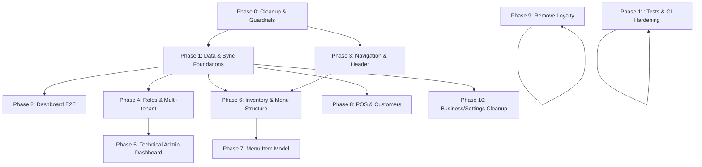

# RMSv3 Implementation Plan

## Overview

This implementation plan outlines a phased approach to address the issues identified in the RMSv3 codebase, with a focus on establishing a solid offline-first architecture. Each phase has clearly defined goals, affected areas, tasks, acceptance criteria, and dependencies.

## Phase 0: Cleanup & Guardrails

**Goals**: Establish a clean codebase with proper guardrails to prevent regression.

**Affected Areas**: Project structure, TypeScript configuration, logging, routing

**Tasks**:
- [ ] Move historical reports from audit/ to docs/archive/
- [ ] Delete temporary/backup files (pnpm-lock.backup.yaml)
- [ ] Organize markdown files in project root into docs/
- [ ] Enable strict TypeScript flags:
  - [ ] Add `noUncheckedIndexedAccess: true` to tsconfig.app.json
  - [ ] Fix broken code resulting from stricter checks
- [ ] Centralize logging:
  - [ ] Replace direct console.log usage with logger
  - [ ] Configure Vite to drop console statements in production
- [ ] Migrate to React Router data router:
  - [ ] Replace BrowserRouter with createBrowserRouter
  - [ ] Define route objects with proper nesting
  - [ ] Set up lazy route modules
  - [ ] Make useUnsavedGuard effective

**Acceptance Criteria**:
- Project root contains only essential configuration files
- All TypeScript strict flags enabled without type errors
- No direct console.* calls in codebase
- Vite configured to strip console/debugger in production
- Data router API used throughout the application
- useUnsavedGuard correctly prevents navigation with unsaved changes
- All routes support lazy loading

**Dependencies**: None - this is the foundation phase

**Status**: Not started

## Phase 1: Data & Sync Foundations

**Goals**: Establish a robust offline-first data architecture with proper synchronization.

**Affected Areas**: Data layer, event store, sync implementation

**Tasks**:
- [ ] Reorganize data layer:
  - [ ] Create `src/data/local` for local database operations
  - [ ] Create `src/data/sync` for sync mechanisms
  - [ ] Create `src/data/remote` for remote API integration
  - [ ] Create `src/data/outbox` for offline-first outbox pattern
- [ ] Implement outbox pattern:
  - [ ] Create outbox queue store
  - [ ] Add operations to outbox when offline
  - [ ] Process outbox on online event
- [ ] Add online triggers:
  - [ ] Enhance syncManager to process outbox on network restoration
  - [ ] Add retry mechanism with backoff
- [ ] Configure PouchDB indexes for hot queries
- [ ] Implement conflict resolution policies:
  - [ ] Define per-domain conflict strategy (server vs client wins)
  - [ ] Implement resolver functions for each domain
- [ ] Add periodic compaction:
  - [ ] Trigger after successful sync
  - [ ] Trigger on application startup
  - [ ] Trigger after significant changes
- [ ] Add event schemas with zod:
  - [ ] Create zod schemas for all event types
  - [ ] Add runtime validation before event processing
- [ ] Implement event versioning:
  - [ ] Add version field to events
  - [ ] Create migration functions between versions

**Acceptance Criteria**:
- All operations work offline and sync when online
- Outbox pattern implemented and functional
- Network status changes trigger appropriate sync actions
- Conflicts handled correctly with defined policies
- PouchDB indexes optimize common queries
- Database size managed through compaction
- All events validated with zod schemas
- Event versioning supports schema evolution

**Dependencies**: Phase 0 for clean codebase foundation

**Status**: Not started

## Phase 2: Dashboard E2E

**Goals**: Make dashboard fully functional with live data and proper UI behavior.

**Affected Areas**: Dashboard components, analytics, filters, status bar

**Tasks**:
- [ ] Connect analytics cards to live data:
  - [ ] Replace dummy data with event projections
  - [ ] Implement data refresh mechanisms
- [ ] Implement compare/filter/sort:
  - [ ] Add date range filters
  - [ ] Add comparison functionality (period vs period)
  - [ ] Fix sort controls on tables
- [ ] Handle status bar:
  - [ ] Either remove status bar entirely
  - [ ] Or fix implementation and document meaning
- [ ] Fix dashboard links:
  - [ ] Ensure all card links navigate to correct routes
  - [ ] Add proper state passing to destination routes

**Acceptance Criteria**:
- Dashboard displays real-time data from events
- All filters, comparisons, and sorts work correctly
- Status bar either removed or functions correctly with documentation
- All dashboard links navigate to the correct routes with proper context
- Dashboard has tests for core functionality

**Dependencies**: Phase 1 for data foundations

**Status**: Not started

## Phase 3: Navigation & Header

**Goals**: Streamline navigation and fix header functionality.

**Affected Areas**: Sidebar, header, search, notifications

**Tasks**:
- [ ] Remove duplicate "collapse sidebar" button
- [ ] Reposition and restyle search bar
- [ ] Connect search to real data:
  - [ ] Implement search indexing
  - [ ] Create search results component
- [ ] Wire notifications to real data:
  - [ ] Create notification store
  - [ ] Connect to events system
- [ ] Fix "See all notifications" routing
- [ ] Align "Settings" and "Account" navigation:
  - [ ] Put Settings in side-nav
  - [ ] Keep Account in user dropdown
  - [ ] Ensure consistent routing

**Acceptance Criteria**:
- No duplicate UI elements
- Search function works and returns relevant results
- Notifications display real data from the system
- "See all notifications" navigates to the notifications view
- Settings and Account navigation is consistent and logical

**Dependencies**: Phase 0 for routing infrastructure

**Status**: Not started

## Phase 4: Roles & Multi-tenant (Owner Model)

**Goals**: Implement proper role-based access control with tenant isolation.

**Affected Areas**: Authentication, authorization, user management

**Tasks**:
- [ ] Implement Business Owner model:
  - [ ] Ensure one owner per business/tenant
  - [ ] Configure owner permissions (full except module toggles)
- [ ] Implement owner-only signup flow
- [ ] Create custom role management:
  - [ ] Add role creation UI
  - [ ] Implement permission assignment
  - [ ] Add module toggle capability for roles
- [ ] Update permission checks:
  - [ ] Enhance DynamicRoleGuard
  - [ ] Add tenant isolation to queries

**Acceptance Criteria**:
- One owner per business enforced
- Business Owner has appropriate permissions
- Custom roles can be created and managed
- Module access can be toggled per role
- Proper permission checks throughout application
- Multi-tenant isolation works correctly

**Dependencies**: Phase 1 for data foundations

**Status**: Not started

## Phase 5: Technical Admin Dashboard

**Goals**: Create administration area for managing tenants.

**Affected Areas**: New admin section, tenant management

**Tasks**:
- [ ] Create technical admin dashboard:
  - [ ] Add tenant listing view
  - [ ] Create tenant detail view
- [ ] Implement tenant management features:
  - [ ] Module toggles per tenant
  - [ ] Suspend/terminate businesses
  - [ ] Export/backup tenant data
  - [ ] Reset owner password functionality
  - [ ] Owner signup approval workflow
  - [ ] Business metadata viewer
  - [ ] Audit log access

**Acceptance Criteria**:
- Technical admin can view all tenants
- Module toggles work at tenant level
- Tenant suspension/termination functions correctly
- Data export/backup works properly
- Password reset for owners functions correctly
- Signup approval workflow is functional
- Business metadata viewable and audit logs accessible

**Dependencies**: Phase 4 for roles and permissions

**Status**: Not started

## Phase 6: Inventory & Menu Structure

**Goals**: Fix inventory and menu structure issues and ensure consistent UI.

**Affected Areas**: Inventory management, menu management, item types

**Tasks**:
- [ ] Move Item Types from `/Manage` to `/Inventory/Items`
- [ ] Create separate form/screen for category creation
- [ ] Remove duplicate "Add Item" button
- [ ] Connect tables to live data:
  - [ ] Implement CRUD for inventory items
  - [ ] Fix edit/delete functionality
- [ ] Fix Inventory Audit:
  - [ ] Connect to real inventory data
  - [ ] Fix creation and completion flow
- [ ] Connect history and reports to live data:
  - [ ] Wire inventory history to events
  - [ ] Implement live reports

**Acceptance Criteria**:
- Item Types accessible in the appropriate location
- Category creation has its own dedicated UI
- No duplicate UI elements
- Tables show live data with working CRUD operations
- Inventory Audit properly integrates with inventory system
- All history and reports show real data

**Dependencies**: Phase 1 for data foundations, Phase 3 for navigation

**Status**: Not started

## Phase 7: Menu Item Model

**Goals**: Refactor Menu Item and Inventory Item relationship to remove duplicated SKUs.

**Affected Areas**: Data models, forms, migrations

**Tasks**:
- [ ] Update data model:
  - [ ] Keep SKU on Inventory Item only
  - [ ] Make Menu Item reference Inventory Item by ID
  - [ ] Add bill of materials support for composite items
- [ ] Update UI forms:
  - [ ] Modify Menu Item forms to reference inventory items
  - [ ] Remove SKU field from Menu Item UI
  - [ ] Add bill of materials selection UI
- [ ] Create data migrations:
  - [ ] Script to update existing Menu Items
  - [ ] Create proper references to Inventory Items
- [ ] Update projections to reflect new model

**Acceptance Criteria**:
- Clear separation between inventory and menu items
- No duplicate SKUs in the system
- Menu items properly reference inventory items
- Bill of materials works for composite items
- Existing data migrated correctly
- All forms updated to reflect new model

**Dependencies**: Phase 6 for inventory structure

**Status**: Not started

## Phase 8: POS & Customers

**Goals**: Fix POS functionality and customer management.

**Affected Areas**: POS, KDS integration, customer management

**Tasks**:
- [ ] Fix PIN requirement for Return/Void:
  - [ ] Implement secure PIN validation
  - [ ] Add PIN request modal
- [ ] Connect order submission to KDS:
  - [ ] Wire order events to KDS
  - [ ] Implement real-time updates
- [ ] Implement notifications for order status
- [ ] Add order history tracking:
  - [ ] Create order history projection
  - [ ] Build order history UI
- [ ] Fix customer CRUD operations:
  - [ ] Implement customer create/update/delete
  - [ ] Fix customer listing
- [ ] Connect POS customer dropdown to live data

**Acceptance Criteria**:
- PIN validation works for Return/Void operations
- Orders submitted from POS appear in KDS
- Notifications show order status changes
- Order history tracks all orders with filtering
- Customer CRUD operations work correctly
- POS customer dropdown shows actual customers

**Dependencies**: Phase 1 for data foundations

**Status**: Not started

## Phase 9: Remove Loyalty

**Goals**: Completely remove the Loyalty module as requested.

**Affected Areas**: Loyalty components, routes, data, UI

**Tasks**:
- [ ] Remove all Loyalty UI components
- [ ] Remove Loyalty routes from App.tsx
- [ ] Remove Loyalty database tables/documents
- [ ] Update navigation to remove Loyalty options
- [ ] Remove Loyalty events from event types
- [ ] Document data migration strategy for existing loyalty data

**Acceptance Criteria**:
- No traces of Loyalty module in UI
- No Loyalty routes accessible
- No Loyalty-related database elements
- Navigation cleaned up
- Migration path documented for existing data

**Dependencies**: None - can be done independently

**Status**: Not started

## Phase 10: Business/Settings Cleanup

**Goals**: Fix Business Account settings and forms.

**Affected Areas**: Branch forms, business settings

**Tasks**:
- [ ] Fix Branch form:
  - [ ] Standardize styling
  - [ ] Improve validation
  - [ ] Simplify inputs
- [ ] Enhance Business Account settings:
  - [ ] Add branch location/address fields
  - [ ] Add Google Maps link integration
  - [ ] Remove rating field
  - [ ] Connect to real persistence

**Acceptance Criteria**:
- Branch forms have consistent styling
- Form validation works correctly
- Branch location/address fields function properly
- Google Maps integration works
- Rating field removed
- All settings properly persist

**Dependencies**: Phase 1 for data foundations

**Status**: Not started

## Phase 11: Tests & CI Hardening

**Goals**: Improve test coverage and CI pipeline.

**Affected Areas**: Tests, CI configuration, Electron

**Tasks**:
- [ ] Choose single test organization pattern:
  - [ ] Either colocated tests or __tests__ directory
  - [ ] Move existing tests to chosen pattern
- [ ] Add missing unit tests:
  - [ ] Core event handlers
  - [ ] Key business logic functions
- [ ] Add integration tests:
  - [ ] Event flow (append → project → query)
  - [ ] UI form submissions
- [ ] Add E2E tests for critical paths:
  - [ ] POS order flow
  - [ ] Inventory count process
- [ ] Configure CI to run tests automatically
- [ ] Harden Electron configuration:
  - [ ] Ensure contextIsolation, nodeIntegration, sandbox settings
  - [ ] Create preload script with narrow API
  - [ ] Improve CSP for production

**Acceptance Criteria**:
- Consistent test structure throughout codebase
- Good test coverage for core functionality
- CI automatically runs tests on changes
- Electron security properly configured
- Application passes security audit

**Dependencies**: All functional phases

**Status**: Not started

## Dependency Map

## Timeline Estimate

| Phase | Estimated Duration | Complexity |
|-------|-------------------|------------|
| Phase 0: Cleanup & Guardrails | 1-2 weeks | Medium |
| Phase 1: Data & Sync Foundations | 3-4 weeks | High |
| Phase 2: Dashboard E2E | 1-2 weeks | Medium |
| Phase 3: Navigation & Header | 1 week | Low |
| Phase 4: Roles & Multi-tenant | 2-3 weeks | High |
| Phase 5: Technical Admin Dashboard | 2 weeks | Medium |
| Phase 6: Inventory & Menu Structure | 2 weeks | Medium |
| Phase 7: Menu Item Model | 2-3 weeks | High |
| Phase 8: POS & Customers | 2 weeks | Medium |
| Phase 9: Remove Loyalty | 3 days | Low |
| Phase 10: Business/Settings Cleanup | 1 week | Low |
| Phase 11: Tests & CI Hardening | 2 weeks | Medium |

**Total Estimated Duration**: 18-24 weeks (4-6 months)

## Risks & Mitigation

| Risk | Impact | Likelihood | Mitigation |
|------|--------|------------|------------|
| Data model changes breaking existing data | High | Medium | Create comprehensive migrations; backup data before changes |
| Performance issues with offline sync | High | Medium | Performance testing early; implement throttling and batching |
| Route migration complexity | Medium | High | Incremental approach; temporary compatibility layer |
| User resistance to role changes | Medium | Medium | Clear documentation; phased rollout with feedback |
| Electron security issues | High | Low | Security audit; follow Electron hardening best practices |

## Success Metrics

- **Offline Functionality**: 100% of core features work without internet
- **Sync Reliability**: >99% sync success rate
- **Performance**: Dashboard loads in <2s; POS operations <500ms
- **Test Coverage**: >80% unit test coverage; all critical paths with E2E tests
- **User Satisfaction**: Positive feedback on role management and inventory integration