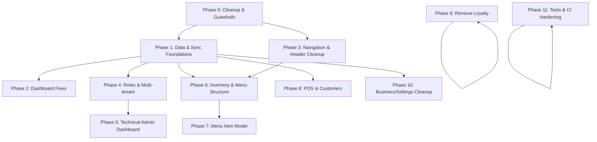

# RMSv3 Refined Implementation Plan

## Overview

This implementation plan addresses specific issues identified in the RMSv3 codebase, focusing on UI problems, functionality gaps, and architectural improvements. The plan is organized in phases with clearly defined tasks and acceptance criteria.

## Phase 0: Cleanup & Guardrails

**Goals**: Establish a clean codebase with proper guardrails.

**Affected Areas**: Project structure, TypeScript, logging, routing

**Tasks**:
- [ ] Move historical reports from audit/ to docs/archive/
- [ ] Delete backup files (pnpm-lock.backup.yaml)
- [ ] Organize markdown files in project root into docs/
- [ ] Enable strict TypeScript flags:
  - [ ] Add `noUncheckedIndexedAccess: true` to tsconfig.app.json
- [ ] Centralize logging:
  - [ ] Replace direct console.log usage with logger
  - [ ] Configure Vite to drop console in production
- [ ] Migrate to React Router data router:
  - [ ] Replace BrowserRouter with createBrowserRouter
  - [ ] Make useUnsavedGuard effective with data router

**Acceptance Criteria**:
- Project root contains only essential configuration files
- All TypeScript strict flags enabled without type errors
- No direct console.* calls in codebase
- Data router API used throughout the application
- useUnsavedGuard correctly prevents navigation with unsaved changes

**Dependencies**: None - this is the foundation phase

**Status**: Not started

## Phase 1: Data & Sync Foundations

**Goals**: Establish robust offline-first architecture.

**Affected Areas**: Data layer, event store, sync implementation

**Tasks**:
- [ ] Reorganize data layer:
  - [ ] Create `src/data/local`, `src/data/sync`, `src/data/remote`, `src/data/outbox` directories
- [ ] Implement outbox pattern for offline operations
- [ ] Add online triggers to process outbox queue
- [ ] Configure PouchDB indexes for hot queries
- [ ] Implement conflict resolution policies per domain
- [ ] Add periodic compaction strategy
- [ ] Implement event schemas with zod validation
- [ ] Add event versioning support

**Acceptance Criteria**:
- All operations work offline and sync when online
- Outbox pattern implemented and functional
- Network status changes trigger appropriate sync actions
- All events validated with zod schemas
- Event versioning supports schema evolution

**Dependencies**: Phase 0 for clean codebase foundation

**Status**: Not started

## Phase 2: Dashboard Fixes

**Goals**: Fix dashboard UI and functionality issues.

**Affected Areas**: Dashboard components, analytics, filters, status bar

**Tasks**:
- [ ] Fix analytics cards and charts:
  - [ ] Replace dummy data with real event-based data
  - [ ] Remove redundant cards identified in audit
  - [ ] Implement data refresh mechanism
- [ ] Implement dashboard filtering:
  - [ ] Fix Compare functionality between periods
  - [ ] Fix Filter controls for date ranges
  - [ ] Fix Sort functionality on tables
- [ ] Address thin bar under Header:
  - [ ] Either remove entirely (`
`)
  - [ ] Or fix broken icon and "0%" display
  - [ ] Document meaning of indicators if kept
- [ ] Fix dashboard links navigation:
  - [ ] Ensure all card links navigate to correct routes
  - [ ] Add proper state passing to destination routes

**Acceptance Criteria**:
- Dashboard displays real-time data from events
- All filters, comparisons, and sorts work correctly
- Status bar either removed or functions correctly with documentation
- All dashboard links navigate to the correct routes

**Dependencies**: Phase 1 for data foundations

**Status**: Not started

## Phase 3: Navigation & Header Cleanup

**Goals**: Fix redundant and broken navigation elements.

**Affected Areas**: Sidebar, header, search, notifications

**Tasks**:
- [ ] Remove duplicate "collapse sidebar" button:
  - [ ] Keep only one button, removing `<button class="hidden lg:flex p-2 text-text-secondary...">` or the alternate version
- [ ] Fix search bar:
  - [ ] Reposition and restyle search bar
  - [ ] Implement functional search with real results
- [ ] Fix notifications:
  - [ ] Replace dummy data with real notifications
  - [ ] Make notifications clickable
  - [ ] Fix "See all notifications" navigation
- [ ] Align Settings vs Account navigation:
  - [ ] Move Settings to side-nav
  - [ ] Keep Account in user dropdown
  - [ ] Ensure consistent routing and purpose separation

**Acceptance Criteria**:
- Only one collapse sidebar button exists
- Search function works with proper styling
- Notifications show real data and are clickable
- "See all notifications" link works
- Clear distinction between Settings and Account sections

**Dependencies**: Phase 0 for routing infrastructure

**Status**: Not started

## Phase 4: Roles & Multi-tenant (Owner Model)

**Goals**: Implement proper business owner and role system.

**Affected Areas**: Authentication, authorization, user management

**Tasks**:
- [ ] Implement Business Owner model:
  - [ ] Ensure one owner per business/tenant
  - [ ] Configure owner permissions (full except module toggles)
  - [ ] Restrict signups to business owners only
- [ ] Clean up existing roles and users
- [ ] Create custom role management:
  - [ ] Add role creation UI
  - [ ] Implement permission assignment
  - [ ] Add module toggle capability for roles

**Acceptance Criteria**:
- One owner per business enforced
- Only business owners can self-signup
- Business Owner has appropriate permissions
- Custom roles can be created and managed
- Module access can be toggled per role
- Old/unused roles purged from system

**Dependencies**: Phase 1 for data foundations

**Status**: Not started

## Phase 5: Technical Admin Dashboard

**Goals**: Create administration area for managing tenants.

**Affected Areas**: New admin section, tenant management

**Tasks**:
- [ ] Create technical admin dashboard:
  - [ ] Add tenant listing view
  - [ ] Create tenant detail view
- [ ] Implement tenant management features:
  - [ ] Module toggles per tenant
  - [ ] Suspend/terminate businesses
  - [ ] Export/backup tenant data
  - [ ] Reset owner password functionality
  - [ ] Owner signup approval workflow
  - [ ] Business metadata viewer
  - [ ] Audit log access

**Acceptance Criteria**:
- Technical admin can view all tenants
- Module toggles work at tenant level
- Tenant suspension/termination functions correctly
- Data export/backup works properly
- Password reset for owners functions correctly
- Signup approval workflow is functional
- Business metadata viewable and audit logs accessible

**Dependencies**: Phase 4 for roles and permissions

**Status**: Not started

## Phase 6: Inventory & Menu Structure

**Goals**: Fix inventory UI issues and functionality.

**Affected Areas**: Inventory management, menu management, item types

**Tasks**:
- [ ] Move Item Types from `/Manage` to `/Inventory/Items`
- [ ] Fix category creation:
  - [ ] Create separate form/screen for category creation
  - [ ] Remove it from item creation form
- [ ] Remove duplicate "Add Item" button in `/Inventory/Items`
- [ ] Fix item table functionality:
  - [ ] Implement edit/delete functionality
  - [ ] Replace dummy columns/data with real inventory data
- [ ] Fix Inventory Audit:
  - [ ] Fix error when starting new count
  - [ ] Connect to real inventory data
- [ ] Connect history and reports to live data:
  - [ ] Replace dummy data in Inventory History
  - [ ] Replace dummy data in Order History
  - [ ] Replace dummy data in KDS Reports
  - [ ] Replace dummy data in Activity Log

**Acceptance Criteria**:
- Item Types accessible in the appropriate location
- Category creation has its own dedicated UI
- Only one "Add Item" button exists
- Edit/delete functionality works in item table
- Tables show live data instead of dummy data
- Inventory Audit starts without errors and connects to real inventory
- All history and report sections display real data

**Dependencies**: Phase 1 for data foundations, Phase 3 for navigation

**Status**: Not started

## Phase 7: Menu Item Model

**Goals**: Fix Menu Item vs Inventory Item relationship.

**Affected Areas**: Data models, forms, migrations

**Tasks**:
- [ ] Update data model:
  - [ ] Keep SKU on Inventory Item only
  - [ ] Make Menu Item reference Inventory Item by ID
  - [ ] Remove duplicate SKU from Menu Item
  - [ ] Add bill of materials support for composite items
- [ ] Update UI forms:
  - [ ] Modify Menu Item forms to reference inventory items
  - [ ] Remove SKU field from Menu Item UI
  - [ ] Add bill of materials selection UI
- [ ] Ensure bi-directional reflection:
  - [ ] Verify Menu reflects Inventory changes
  - [ ] Test integration with POS & KDS

**Acceptance Criteria**:
- Clear separation between inventory and menu items
- No duplicate SKUs in the system
- Menu items properly reference inventory items
- Bill of materials works for composite items
- Changes in inventory reflect in menu and vice versa
- Menu properly integrates with POS and KDS

**Dependencies**: Phase 6 for inventory structure

**Status**: Not started

## Phase 8: POS & Customers

**Goals**: Fix POS functionality and customer management.

**Affected Areas**: POS, KDS integration, customer management

**Tasks**:
- [ ] Fix PIN requirement for Return/Void:
  - [ ] Implement secure PIN validation
  - [ ] Add PIN request modal
- [ ] Connect order submission to KDS:
  - [ ] Wire order events to KDS
  - [ ] Implement real-time updates
- [ ] Implement notifications for order status
- [ ] Add order history tracking
- [ ] Fix customer management:
  - [ ] Fix customer create/update/delete functionality
  - [ ] Ensure created customers appear in listing
  - [ ] Fix View/Edit functionality
- [ ] Connect POS customer dropdown to live data

**Acceptance Criteria**:
- PIN validation works for Return/Void operations
- Orders submitted from POS appear in KDS
- Notifications show order status changes
- Order history tracks all orders
- Customer CRUD operations work correctly
- POS customer dropdown shows actual customers

**Dependencies**: Phase 1 for data foundations

**Status**: Not started

## Phase 9: Remove Loyalty

**Goals**: Remove Loyalty module completely.

**Affected Areas**: Loyalty components, routes, data, UI

**Tasks**:
- [ ] Remove all Loyalty UI components
- [ ] Remove Loyalty routes from App.tsx
- [ ] Remove Loyalty database tables/documents
- [ ] Update navigation to remove Loyalty options
- [ ] Remove Loyalty events from event types
- [ ] Document data migration strategy for existing loyalty data

**Acceptance Criteria**:
- No traces of Loyalty module in UI
- No Loyalty routes accessible
- No Loyalty-related database elements
- Navigation cleaned up
- Migration path documented for existing data

**Dependencies**: None - can be done independently

**Status**: Not started

## Phase 10: Business/Settings Cleanup

**Goals**: Fix Branch and Business Account settings.

**Affected Areas**: Branch forms, business settings

**Tasks**:
- [ ] Fix Branch form (`/Manage/Branches`):
  - [ ] Standardize styling with global components
  - [ ] Improve validation
  - [ ] Simplify inputs
  - [ ] Apply same fixes to edit form
- [ ] Enhance Business Account settings:
  - [ ] Add branch location/address fields
  - [ ] Add Google Maps link integration
  - [ ] Remove rating field
  - [ ] Replace dummy data with real fields
  - [ ] Connect to real persistence

**Acceptance Criteria**:
- Branch forms have consistent styling and reasonable inputs
- Form validation works correctly
- Branch location/address fields function properly
- Google Maps integration works
- Rating field removed
- All settings properly persist

**Dependencies**: Phase 1 for data foundations

**Status**: Not started

## Phase 11: Tests & CI Hardening

**Goals**: Improve test coverage and CI pipeline.

**Affected Areas**: Tests, CI configuration, Electron

**Tasks**:
- [ ] Choose single test organization pattern
- [ ] Add missing unit tests
- [ ] Add integration tests
- [ ] Add E2E tests for critical paths
- [ ] Configure CI to run tests automatically
- [ ] Harden Electron configuration

**Acceptance Criteria**:
- Consistent test structure throughout codebase
- Good test coverage for core functionality
- CI automatically runs tests on changes
- Electron security properly configured
- Application passes security audit

**Dependencies**: All functional phases

**Status**: Not started

## Dependency Map

## Timeline Estimate

| Phase | Estimated Duration | Complexity |
|-------|-------------------|------------|
| Phase 0: Cleanup & Guardrails | 1-2 weeks | Medium |
| Phase 1: Data & Sync Foundations | 3-4 weeks | High |
| Phase 2: Dashboard Fixes | 1-2 weeks | Medium |
| Phase 3: Navigation & Header Cleanup | 1 week | Low |
| Phase 4: Roles & Multi-tenant | 2-3 weeks | High |
| Phase 5: Technical Admin Dashboard | 2 weeks | Medium |
| Phase 6: Inventory & Menu Structure | 2 weeks | Medium |
| Phase 7: Menu Item Model | 2-3 weeks | High |
| Phase 8: POS & Customers | 2 weeks | Medium |
| Phase 9: Remove Loyalty | 3 days | Low |
| Phase 10: Business/Settings Cleanup | 1 week | Low |
| Phase 11: Tests & CI Hardening | 2 weeks | Medium |

**Total Estimated Duration**: 18-24 weeks (4-6 months)

## Priority Issues Summary

This plan specifically addresses all user-reported issues:

1. **Dashboard Issues**:
   - Replace dummy data with real data in analytics cards/charts
   - Fix Compare/Filter/Sort functionality
   - Fix or remove the thin bar under Header showing broken icon & "0%"
   - Fix non-navigating dashboard links

2. **Header/Navigation Issues**:
   - Remove redundant collapse sidebar button
   - Fix search bar positioning, styling, and functionality
   - Connect notifications to real data and make them clickable
   - Align Settings vs Account navigation

3. **Roles & Multi-tenant**:
   - Ensure one Business Owner per business/tenant
   - Configure proper permissions hierarchy
   - Enable module toggle capability for roles

4. **Technical Admin Dashboard**:
   - Create dedicated admin area to manage businesses
   - Implement tenant management features (modules, suspension, etc.)

5. **Inventory & Menu Issues**:
   - Move Item Types to proper location
   - Create separate category creation form
   - Remove duplicate Add Item button
   - Fix edit/delete functionality and connect to real data
   - Fix Inventory Audit connection to inventory
   - Connect history and reports to real data

6. **Menu Item Model**:
   - Resolve SKU duplication between Menu and Inventory items
   - Make Menu Item reference Inventory Item by ID
   - Support bill of materials for composite items

7. **POS & Customer Issues**:
   - Fix PIN requirement for Return/Void
   - Connect order submission to KDS
   - Fix customer CRUD operations and dropdown integration

8. **Loyalty Module**:
   - Complete removal of all Loyalty-related code and UI

9. **Business Settings**:
   - Fix Branch form styling and validation
   - Add location/address fields and Google Maps integration
   - Remove rating field
   - Connect to real persistence
